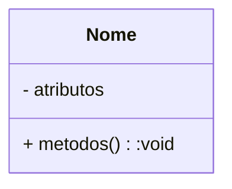
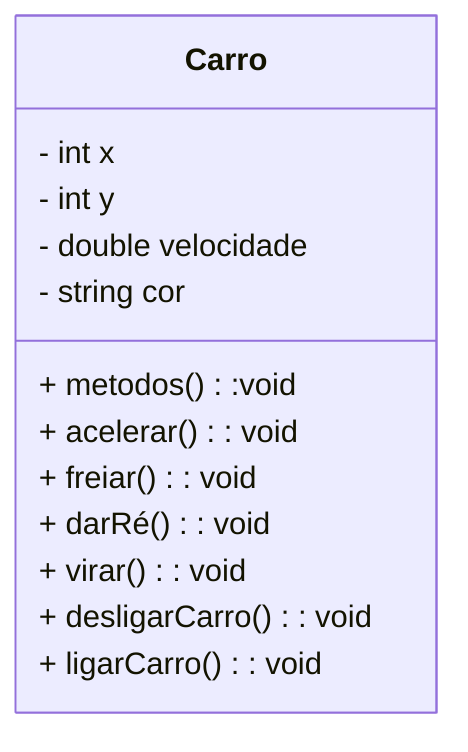
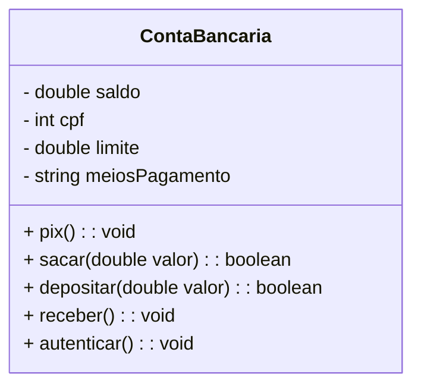
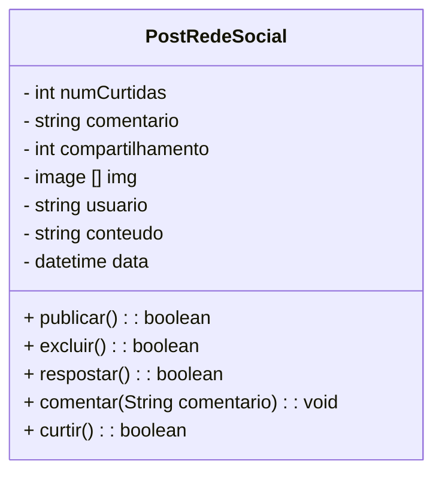
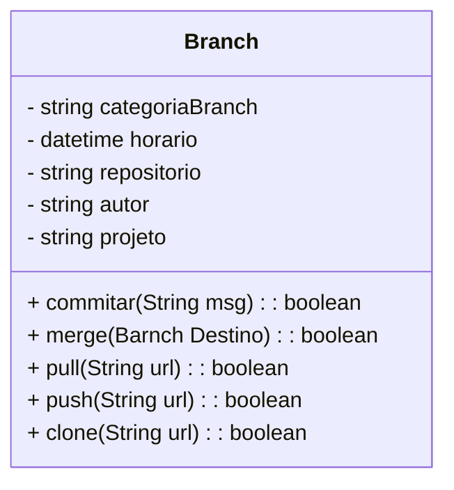

# Exercícios de Abstração

Diagramas de classe são utilizados para representar objetos que irão compor um sistema.

Veja abaixo um exemplo de uma Classe representada em diagrama:

1. Modele uma classe que represente um carro.

2. Moedelar uma classe que represente uma Conta Bancária

3. Modele uma Classe que represente que represente um Post (de uma rede social).

4. Modelar uma clsse que represente uma Branch

